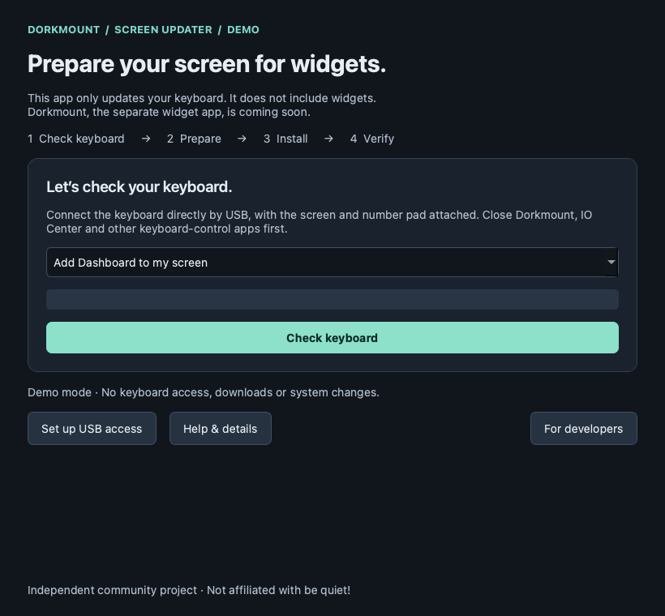
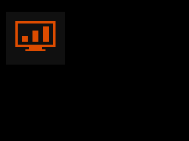

# Dorkmount Patcher

Prepare your **be quiet! Dark Mount** keyboard for custom widgets.

**This app only updates the keyboard. It does not provide or run widgets.**
[Dorkmount](https://github.com/JimStroomberg/Dorkmount), the separate companion
app, is **coming soon** and will provide the widgets. Developers can also build
other compatible companion apps.

After patching, the Clock icon becomes **Dashboard**. Open it and the screen
shows **Waiting…** until a compatible companion starts drawing. Patching alone
does not install widgets. Left/Right changes companion views; double-click Menu
returns to the keyboard's app selector.

*Preview of the Dashboard icon rendered by the patched firmware; not a keyboard photograph.*

## Compatibility

| System | Status |
|---|---|
| Current stable CachyOS, x86-64 | Installation, restoration and Dashboard confirmed on the test keyboard |
| Ubuntu 26.04, x86-64 | Package/container checks pass; real-machine verification pending |
| Newer Ubuntu releases | Validate individually before claiming support |
| macOS on Apple Silicon | Soon |
| Bazzite | Soon |
| Windows | Later |

The supported keyboard is Dark Mount **model 1, hardware revision 1**, with the
Media Dock and Numpad attached and the exact supported **1.29.0** firmware set.
The app checks compatibility before preparing an update. Other revisions or
firmware versions are refused. See [compatibility and hashes](docs/FIRMWARE.md).

This is a **beta release**. The maintainer has confirmed installation,
restoration, reinstallation, drawing, navigation, reconnect and app-restart
checks on CachyOS. This does not establish recovery from every interrupted update
or a keyboard that no longer starts. [Validation and limits](docs/VALIDATION.md)

## Install and use

1. Download the matching package from [Releases](https://github.com/JimStroomberg/Dorkmount-patcher/releases).
   **Dashboard requires 0.2.0-beta.1 or newer.** Alpha.1/alpha.2 use the older Clock-based patch.
2. Install the package, reconnect the keyboard and open **Dorkmount Patcher**.
3. Close other keyboard-control apps. Choose **Check keyboard → Prepare update → Install Dashboard**.
4. Keep the keyboard connected until verification finishes. Close the updater,
   select the dashboard icon and start a compatible widget app.

Native packages include the app, menu shortcut and keyboard-access rule. Your
package manager installs the required libraries; no Python setup or firmware
compiler is needed. [Installation and restoration](docs/INSTALLING.md) ·
[Troubleshooting](docs/TROUBLESHOOTING.md) · [Current release notes](docs/releases/v0.2.0-beta.1.md)

## Developers and contributors

Build your own companion with the standalone [DirectDraw developer guide](docs/DEVELOPERS.md)
and [Python example](examples/first_pixels.py). DMR3 provides volatile 320×240
RGB565 drawing and Left/Right navigation. Older clients must recognize DMR3.
Live drawing on the eight display keys, atomic frame swaps and a heartbeat are
not implemented. New host widgets do not require new firmware.

[Run or build from source](docs/BUILDING.md) · [Required libraries](docs/DEPENDENCIES.md) ·
[Contributing and PRs](CONTRIBUTING.md) · [Release workflow](docs/RELEASING.md) ·
[Architecture](docs/ARCHITECTURE.md)

`--demo` previews the desktop app without keyboard access, downloads or system
changes. The demo also runs on macOS; Mac firmware installation is not supported yet.

## Source and attribution

The repository contains project source and small replacement patches. It does
not distribute manufacturer firmware or complete patched images. The app
obtains the exact official files and keeps generated images, restoration copies
and update records on your computer. Do not upload them to issues.

Published by **Jim Stroomberg**. Project source is **GPL-3.0-only** and builds on
the QLink work in [re133/iocenter-linux](https://github.com/re133/iocenter-linux).
[Third-party notices](THIRD_PARTY.md) · [Provenance](docs/PROVENANCE.md) ·
[Report a security problem](SECURITY.md)

Independent community project, not affiliated with or supported by be quiet!.
